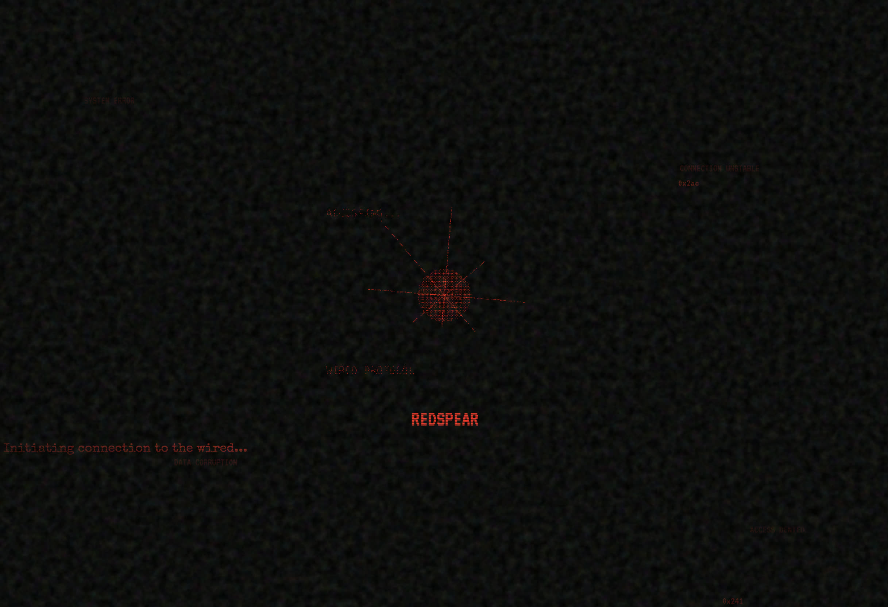

# REDSPEAR

An alternate reality game exploring the depths of the wired.

## Layers

- **Layer 01: GATEWAY** - Initiation into the digital realm.
- **Layer 02: NOISE** - Overwhelmed by the signal.
- **Layer 03: EYE** - Surveillance and revelation.
- **Layer 04: SCROLL** - Endless archives of fragmented data.
- **Layer 05: MEMORY** - Corrupted recollections.
- **Layer 06: CONNECTION** - Authentication with the core.
- **Layer 07: DISCONNECTED** - Failure and isolation.
- **Layer 08: INTEGRATION** - Successful upload.

## How to Experience

Open `index.html` in a web browser and navigate the layers. No external dependencies required.

## Technologies

- HTML5
- CSS3
- JavaScript
- Audio (Web Audio API)

## License

This project is for entertainment purposes. All rights reserved.